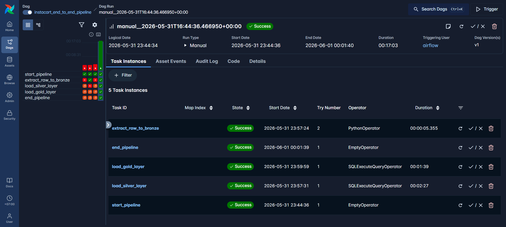
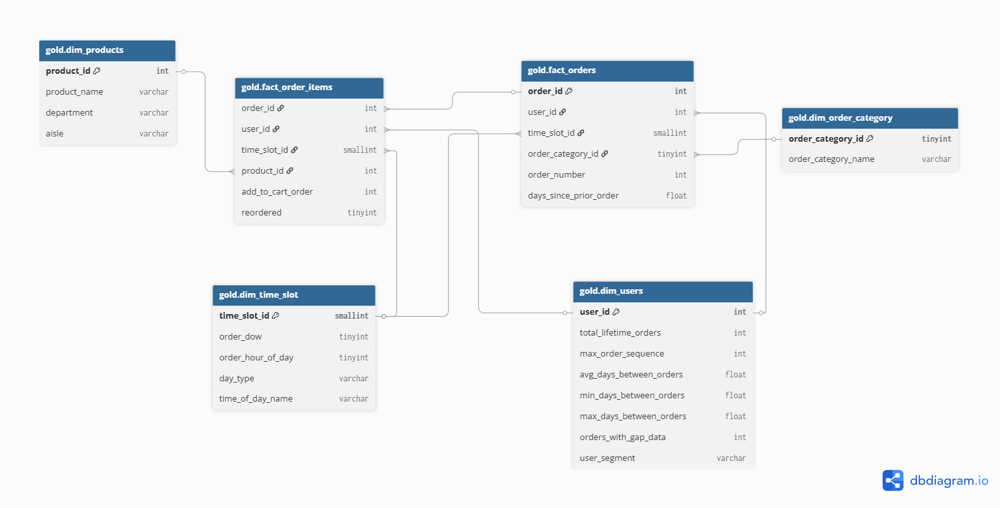
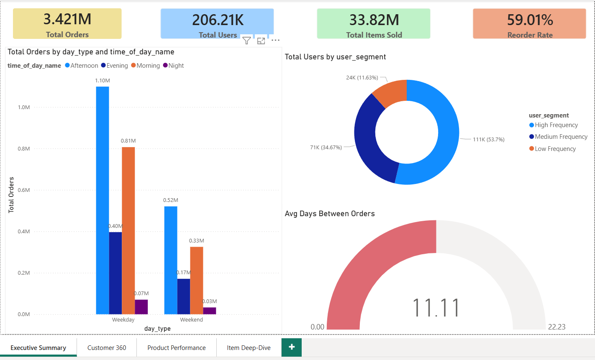
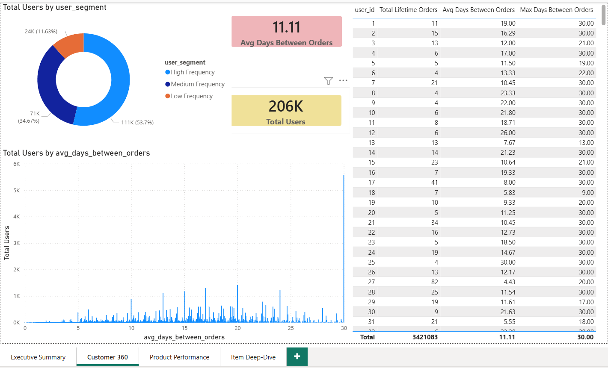
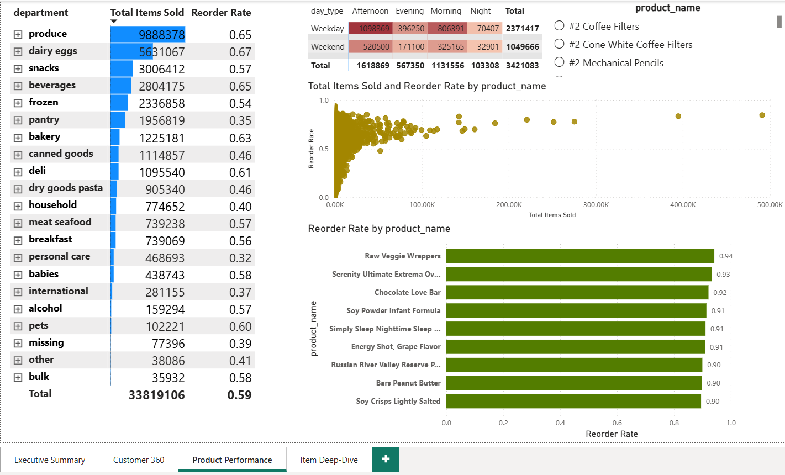
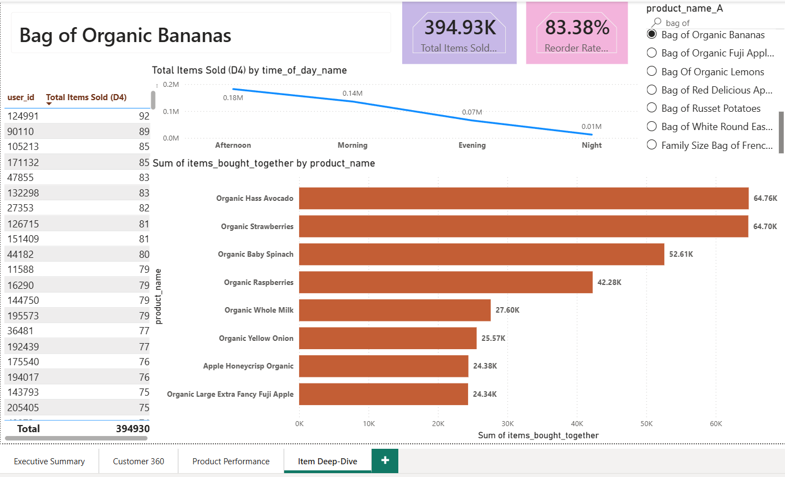

# 🛒 Instacart Market Basket Analysis: End-to-End Data Pipeline & Analytics


## 📌 Project Overview
This project is an end-to-end **Data Engineering and Data Analytics** solution built around the famous [Instacart Market Basket dataset](https://www.kaggle.com/datasets/psparks/instacart-market-basket-analysis). The primary goal is to build a robust, scalable automated data pipeline that processes over **34 million rows** of transactional data, transforming it into a business-ready **Star Schema**, and uncovering actionable insights regarding customer purchasing behaviors.

This repository demonstrates my capability to conceptualize, design, and implement a full-stack data project suitable for real-world enterprise environments.

---

## 🏗️ System Architecture
The project strictly implements the **Medallion Architecture** pattern (Bronze ➔ Silver ➔ Gold), orchestrated dynamically via **Apache Airflow** running in a **Dockerized** environment.

<div align="center">
  
</div>

### 🥉 1. Bronze Layer (Raw Data Ingestion)
- **Tooling:** Python (Pandas/SQLAlchemy) 
- **Methodology:** 
  - Scans `1_Inbound_Data` for raw CSV drops.
  - Safely buffers raw data by moving it to `2_Processing_Data` to prevent lock issues.
  - To prevent memory crashes when handling the massive `order_products` dataset (32.4M+ rows), data is read and ingested incrementally using **Pandas Chunks (150,000 rows/chunk)**.
  - Appends strict audit trails: `_source_file_name` and `_etl_load_datetime`.
  - Processed files are moved to `3_Archive_Data` ensuring idempotency. Errors are routed to `4_Error_Data`.

### 🥈 2. Silver Layer (Cleansing & Structuring)
- **Tooling:** SQL Server (Stored Procedures)
- **Methodology:** 
  - Standardizes data types (e.g., casting optimized `TINYINT` for Day_Of_Week/Hour, `FLOAT` for calculations).
  - Merges `__prior` and `__train` datasets logically utilizing high-performance `UNION ALL`.
  - Implements **Clustered Columnstore Index (CCI)** on the massive 33.8 million row orders table. This dramatically compresses data and reduces I/O bottleneck, acting as a massive performance tuner for downstream analytical queries.

### 🥇 3. Gold Layer (Business Value & Star Schema)
- **Tooling:** SQL Server (Stored Procedures)
- **Methodology:** 
  - Constructs a highly optimized **Star Schema**.
  - **`dim_products`**: Denormalizes Snowflake structure (Products + Departments + Aisles) to simplify BI reporting.
  - **`dim_users`**: Extracted implicitly representing customers with lifetime aggregated logic (`total_lifetime_orders`).
  - **`dim_time_slot`**: Derived dimensional logic mapping out 'Weekend vs Weekday' and 'Morning/Afternoon/Evening/Night' buckets.
  - **`fact_order_items`**: The optimized heavy-lifting fact table storing every single product interaction.

<div align="center">
  
</div>

---

## ⚙️ Tech Stack & Skills Showcased

| Category | Technologies / Concepts Highlights |
| :--- | :--- |
| **Data Engineering** | Apache Airflow (DAGs, Operators), Python, ETL/ELT pipelines, Chunking optimization, Medallion Architecture, Idempotency design |
| **Database Ops** | Microsoft SQL Server, Stored Procedures, **Columnstore Indexes**, Star Schema, Dimensional Modeling (Kimball), Query Tuning |
| **Data Analysis** | Python (Pandas), SQL Analytics, Jupyter Notebooks, Market Basket Analysis concepts, Data preprocessing |
| **DevOps / Infra** | Docker, Docker Compose, Version Control (Git) |

---

## 📈 Analytical Capabilities (Market Basket Analysis) & Power BI Dashboards
The `src/analy.ipynb` and `sql_query/` views utilize the robust **Gold schema** to extract business patterns:
* **Product Affinities:** Which items are most frequently placed in the cart first?
* **Reorder Trends:** Identifying high-retention products and categories.
* **Temporal Patterns:** Are weekends busier than weekdays? Do specific departments spike in the mornings (e.g., breakfast foods) vs. evenings?

*(Check out `sql_query/fact_market_basket.sql` for deep-dive association rules).*

### 📊 Power BI Dashboard Gallery
The data pipeline powers a comprehensive BI reporting suite. Below are the key reports highlighting different analytical angles:

**1. Executive Summary:** High-level KPIs, total orders, revenue proxy, and overall purchasing trends.
<div align="center">
  
</div>

**2. Customer 360:** Insights into user behaviors, order frequencies, and lifetime value segments.
<div align="center">
  
</div>

**3. Product Performance:** Evaluation of best-selling products, category distributions, and reorder rates.
<div align="center">
  
</div>

**4. Item Deep Dive & Market Basket:** Association patterns and detailed drill-downs on product relationships.
<div align="center">
  
</div>

---

## 🚀 How to Run the Project Locally

### 1. Requirements
* Docker & Docker Compose
* MS SQL Server (can be run via Docker `mcr.microsoft.com/mssql/server`)
* Python 3.x

### 2. Setup
1. Clone this repository.
   ```bash
   git clone https://github.com/hoangdev-vdh/Instacart_Market_Basket_DW_Project.git
   ```
2. Place the unzipped raw Instacart Kaggle CSVs inside `data/1_Inbound_Data/`.
3. Start the Airflow cluster via Docker:
   ```bash
   cd instacart_airflow
   docker-compose up -d
   ```
4. Access the Airflow Webserver at `http://localhost:8080`.
5. Trigger the DAG: `instacart_end_to_end_pipeline`. Monitor the seamless ingestion from Bronze to Silver to Gold!
